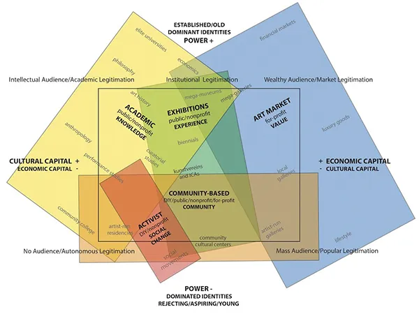

  

<Language code="es">
Al revisar el campo cultural actual, se observa una gran proliferación del arte facilitada por los diversos medios que posibilitan tanto su reproducción como su aprendizaje. Existe un alto grado de fragmentación, numerosos nichos y multiplicidad de temáticas que jamás habrá tiempo de visitar. De allí deviene una mixtura de técnicas y lenguajes, en conjunto con un solapamiento de marcos teóricos y conceptuales que se ponen en conversación dentro de lo que llamamos arte contemporáneo.

Este contexto puede resultar un aliciente para la inciación del artista, una invitación a lanzarse en el mundo del arte. Puede servir de oportunidad para generar equipos multidisciplinarios de investigación y producción artística. Se divisa incluso una potencia para subvertir o promocionar diversos dispositivos. Generando de esta manera una imagen de amplitud, fluidez y posibilidad.

¿Y si en realidad esas libertades y posibilidades se encuentran montadas sobre un territorio en disputa? ¿Podría ocurrir que los diferentes actores que lo componen sean tan opuestos como necesarios para la subsistencia del ecosistema artístico? ¿Si todo eso que se divisa como fluidez y liviandad son fuerzas en tensión?

**Desarrollo técnico, estético y conceptual**

**(ar)territorio** es un mar de partículas que ganan energía cinética gracias a la fuerza de un campo de vectores, y pone a disposición la pregunta acerca de la libertad de acción y los posicionamientos dentro del marco del arte contemporáneo. Se puede intercalar entre dos estadios haciendo click sobre la obra. Uno de ellos tiene tonalidades de gris y movimientos menos controlados, que ocupan todo el espacio. En el segundo, las partículas se aúnan por una variación en los vectores, formando algo parecido a líneas de color negro que siguen una tendencia más definida.

En _"Sobre el arte contemporáneo"_, Cesar Aira permite entrever un estado del arte lleno de posibilidades, exploraciones y matices, que debido a determinadas características temporales, permite seguir forjando su lenguaje a medida que se producen nuevas obras, en sus palabras: "ser su propia documentación". Aún así, más allá de la diversidad y las mixturas técnicas, toda esta producción termina bajo el paraguas del arte contemporáneo.

Otro ángulo sobre el mismo proceso histórico propone que, junto con ese solapamiento, coexiste una ubicación al interior del territorio artístico. En el mapa de este territorio, planteado por Andrea Fraser en _"The field of contemporary art: A diagram."_, un artículo de e-flux, se aprecian dos ejes, el del valor cultural/económico y el eje del poder. Los puntos más cardinales en este cuadro son tan opuestos como necesarios para que el ecosistema siga en movimiento. Hallamos también, vestigios de los diversos actores que componen el territorio y su rol en el mismo dentro del texto de Aira, cuando expone la tensión entre reproducción y obra de arte en las revistas, o cuando nombra críticos de arte y sus maneras de analizar obra.

El diagrama incluye diversos subcampos que se encuentran solapados y que, si bien hubo momentos de tensión entre ellos, en la época que transcurre, según Fraser, entablan una relación simbiótica y casi parasitaria, de sostén mutuo. Sumada a esta conclusión, la autora provee al artista, a través del mapa conceptual, de una poderosa herramienta de posicionamiento dentro de dicho ámbito.

La invitación a hacer arte que nos propone Aira, o el panorama y la ubicación dentro del universo artístico que otorga el diagrama de Fraser, son perspectivas complementarias que puede resultar útil no olvidar a la hora de plantearse un proyecto. Saberse dentro de un territorio que, si bien se muestra amplio y variado, no deja de forjarse bajo diversas fuerzas en tensión, no deja de ser un territorio en disputa al que estamos arrojados.

**Bibliografía**

- Aira, Cesar. (2010). Sobre el arte contemporáneo. Editorial Grijalbo-Mondadori.
- Fraser, Andrea. (2024, October 17). The field of contemporary art: A diagram. e-flux. https://www.e-flux.com/notes/634540/the-field-of-contemporary-art-a-diagram
</Language>

<Language code="en">
When reviewing the current cultural field, a great proliferation of art is observed, facilitated by the various media that make both its reproduction and learning possible. There is a high degree of fragmentation, numerous niches and a multiplicity of themes that there will never be time to visit. From there comes a mixture of techniques and languages, together with an overlap of theoretical and conceptual frameworks that are put into conversation within what we call contemporary art.

This context can be an incentive for the artist's initiation, an invitation to launch himself into the world of art. It can serve as an opportunity to generate multidisciplinary research and artistic production teams. There is even a potential to subvert or promote various devices. Thus generating an image of breadth, fluidity and possibility.

What if in reality those freedoms and possibilities are mounted on a disputed territory? Could it happen that the different actors that make it up are as opposite as they are necessary for the survival of the artistic ecosystem? If all that which is seen as fluidity and lightness are forces in tension?

**Technical, aesthetic and conceptual development**

**(ar)territory** is a sea of particles that gain kinetic energy thanks to the force of a vector field, and raises the question about freedom of action and positioning within the framework of contemporary art. You can switch between two stages by clicking on the work. One of them has shades of gray and less controlled movements, which occupy the entire space. In the second, the particles are brought together by a variation in the vectors, forming something similar to black lines that follow a more defined trend.

In _"On contemporary art"_, Cesar Aira allows us to glimpse a state of art full of possibilities, explorations and nuances, which due to certain temporal characteristics, allows us to continue forging its language as new works are produced, in his words: "being its own documentation." Still, beyond the diversity and technical mixtures, all this production ends up under the umbrella of contemporary art.

Another angle on the same historical process proposes that, along with this overlap, a location coexists within the artistic territory. In the map of this territory, proposed by Andrea Fraser in _"The field of contemporary art: A diagram."_, an e-flux article, two axes can be seen, that of cultural/economic value and the axis of power. The most cardinal points in this chart are as opposite as they are necessary for the ecosystem to continue moving. We also find vestiges of the various actors that make up the territory and their role in it within Aira's text, when he exposes the tension between reproduction and work of art in magazines, or when he names art critics and their ways of analyzing work.

The diagram includes various subfields that overlap and, although there were moments of tension between them, in the period that passes, according to Fraser, they establish a symbiotic and almost parasitic relationship, of mutual support. Added to this conclusion, the author provides the artist, through the conceptual map, with a powerful positioning tool within said field.

The invitation to make art that Aira proposes to us, or the panorama and location within the artistic universe that Fraser's diagram provides, are complementary perspectives that can be useful not to forget when considering a project. Knowing ourselves within a territory that, although it appears broad and varied, continues to be forged under various forces in tension, is still a disputed territory into which we are thrown.

**Literature**

- Aira, Cesar. (2010). Sobre el arte contemporáneo. Editorial Grijalbo-Mondadori.
- Fraser, Andrea. (2024, October 17). The field of contemporary art: A diagram. e-flux. https://www.e-flux.com/notes/634540/the-field-of-contemporary-art-a-diagram
</Language>
