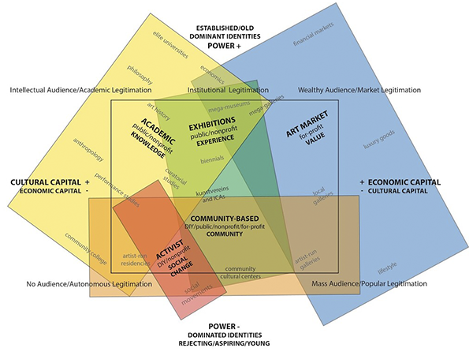

  

_Mauro Giachero_, 2024.

**(ar)territorio**

Al revisar el campo cultural actual, se observa una gran proliferación del arte facilitada por los diversos medios que posibilitan tanto su reproducción como su aprendizaje. Existe un alto grado de fragmentación, numerosos nichos y multiplicidad de temáticas que jamás habrá tiempo de visitar. De allí deviene una mixtura de técnicas y lenguajes, en conjunto con un solapamiento de marcos teóricos y conceptuales que se ponen en conversación dentro de lo que llamamos arte contemporáneo.

Este contexto puede resultar un aliciente para la inciación del artista, una invitación a lanzarse en el mundo del arte. Puede servir de oportunidad para generar equipos multidisciplinarios de investigación y producción artística. Se divisa una potencia para subvertir o promocionar diversos dispositivos. Generando así una imagen de amplitud, fluidez y posibilidad.

¿Y si en realidad esas libertades y posibilidades se encuentran montadas sobre un territorio en disputa? ¿Podría ocurrir que los diferentes actores que lo componen sean tan opuestos como necesarios para la subsistencia del ecosistema artístico? ¿Si todo eso que se divisa como fluidez y liviandad son fuerzas en tensión?

**Desarrollo técnico, estético y conceptual**

(ar)territorio es un mar de partículas que ganan energía cinética gracias a la fuerza de un campo de vectores, y pone a disposición la pregunta acerca de la libertad de acción y los posicionamientos dentro del marco del arte contemporáneo. Se puede intercalar entre dos estadios haciendo click sobre la obra. Uno de ellos tiene tonalidades de gris y movimientos menos controlados, que ocupan todo el espacio. En el segundo, las partículas se aúnan por una variación en los vectores, formando algo parecido a líneas de color negro que siguen una tendencia más definida.

En "Sobre el arte contemporáneo" Cesar Aira permite entrever un estado del arte lleno de posibilidades, exploraciones y matices, que debido a determinadas características temporales, permite seguir forjando su lenguaje a medida que se producen nuevas obras, en sus palabras: "ser su propia documentación". Aún así, más allá de la diversidad y las mixturas técnicas, toda esta producción termina bajo el paraguas del arte contemporáneo.

Otro ángulo sobre el mismo proceso histórico propone que junto con ese solapamiento coexiste una ubicación en el territorio artístico. El mapa de este territorio, planteado por Andrea Fraser en "The field of contemporary art: A diagram.", un artículo de e-flux, se mueve entre dos ejes, el del valor cultural/económico y el eje del poder. Los puntos más cardinales en este cuadro son tan opuestos como necesarios para que el ecosistema siga en movimiento. Hallamos vestigios de esto en el texto de Aira, cuando nos expone la tensión entre reproducción y obra de arte en las revistas, o cuando nombra críticos de arte y sus maneras de analizar obra.

El diagrama incluye diversos subcampos que se encuentran solapados y que, si bien hubo momentos de tensión entre ellos, en la época que transcurre, según Fraser, por más de encontrarse en polos opuestos, entablan una relación simbiótica y casi parasitaria, de sostén mutuo. Sumada a esta conclusión, la autora otorga una poderosa herramienta de emplazamiento y posicionamiento dentro del campo contemporáneo para el artista.

La invitación a hacer arte que nos propone Aira, o el panorama y la ubicación dentro del universo artístico que otorga el diagrama de Fraser, son perspectivas complementarias que puede resultar útil no olvidar a la hora de plantearse un proyecto. Saberse dentro de un territorio que, si bien se muestra amplio y variado, no deja de forjarse con fuerzas en tensión, no deja de ser un territorio en disputa al que estamos arrojados.

**Bibliografía**

- Aira, Cesar. (2010). Sobre el arte contemporáneo. Editorial Grijalbo-Mondadori.
- Fraser, Andrea. (2024, October 17). The field of contemporary art: A diagram. e-flux. https://www.e-flux.com/notes/634540/the-field-of-contemporary-art-a-diagram
